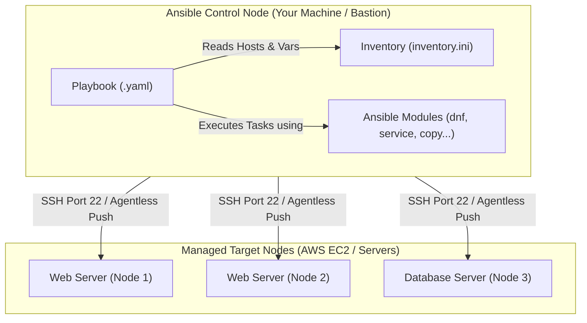

# Ansible Zero to Hero: Complete Guide & Hands-on Reference

> A beginner-friendly, structured guide explaining core Ansible concepts, terminology, configuration management patterns, and real-world DevOps use cases.

---

## 📑 Table of Contents
1. [What is Ansible?](#what-is-ansible)
2. [Why Do We Use Ansible? (Real-World Use Cases)](#why-do-we-use-ansible-real-world-use-cases)
3. [Ansible Architecture & Core Terminology](#ansible-architecture--core-terminology)
4. [Idempotency Explained](#idempotency-explained)
5. [Connection Types: Remote vs Local Execution](#connection-types-remote-vs-local-execution)
6. [Playbook Structure & First Steps](#playbook-structure--first-steps)
7. [Variables & The 6-Level Precedence Hierarchy](#variables--the-6-level-precedence-hierarchy)
8. [Data Types & Complex Data Structures](#data-types--complex-data-structures)
9. [Conditions & Ansible Facts](#conditions--ansible-facts)
10. [Loops & Batch Installations](#loops--batch-installations)
11. [Jinja2 Filters](#jinja2-filters)
12. [Error Handling & Failure Management](#error-handling--failure-management)
13. [Hands-on Playbook Index & Practice Map](#hands-on-playbook-index--practice-map)
14. [Essential Ansible CLI Commands Cheat Sheet](#essential-ansible-cli-commands-cheat-sheet)

---

## What is Ansible?

**Ansible** is an open-source IT automation engine that automates:
* **Configuration Management:** Installing packages, configuring files, managing users, and starting services across multiple operating systems.
* **Application Deployment:** Deploying software binaries or web applications seamlessly across development, staging, and production servers.
* **Orchestration:** Executing multi-tier deployments in a strict, predictable sequence (e.g., Database -> Backend -> Frontend).

### Key Architectural Traits:
1. **Agentless:** Unlike Puppet or Chef, you do **not** need to install any agent software or daemon on target servers. Ansible connects securely over standard **SSH** (for Linux) or **WinRM** (for Windows).
2. **Push-Based:** The control node executes playbooks and pushes tasks directly to remote nodes.
3. **Declarative:** You define the desired end state (e.g., `state: present`, `state: started`), and Ansible determines the steps needed to reach that state.

---

## Why Do We Use Ansible? (Real-World Use Cases)

| Scenario | Without Ansible (Manual) | With Ansible (Automated) |
| :--- | :--- | :--- |
| **Fleet OS Patching** | Logging into 50 EC2 instances one-by-one with SSH and running `dnf update -y`. Takes hours and prone to human error. | A single playbook run across all 50 servers in parallel in under 2 minutes. |
| **Consistent Environments** | Dev, QA, and Prod servers have slightly different package versions, causing "it works on my machine" bugs. | The same playbook configures all environments identically, ensuring 100% consistency. |
| **Security & Compliance** | Manually creating users, rotating passwords, or auditing SSH keys across servers. | Centralized playbooks enforce user presence, sudo permissions, and SSH authorized keys automatically. |
| **Disaster Recovery** | Re-building destroyed servers from memory or outdated setup documentation. | Re-run the infrastructure playbook to spin up and configure identical servers in minutes. |

---

## Ansible Architecture & Core Terminology



### Core Definitions:
* **Control Node:** The computer where Ansible is installed. Playbooks and commands are executed from here.
* **Managed Node (Target Host):** The remote servers managed by Ansible (e.g., EC2 instances, virtual machines).
* **Inventory:** A file ([inventory.ini](file:///Users/sriramcharankolla/Desktop/DevOps/ansible/inventory.ini#L1-L15)) listing hostnames or IP addresses grouped by role (e.g., `[web]`, `[db]`).
* **Module:** A discrete unit of reusable code that performs a specific action (e.g., `ansible.builtin.dnf`, `ansible.builtin.service`, `ansible.builtin.user`).
* **Task:** The execution of a single module with specific parameters inside a play.
* **Play:** A mapped execution of tasks targeted to a specific group of hosts.
* **Playbook:** A YAML file containing one or more plays.

---

## Idempotency Explained

**Idempotency** is one of the most critical concepts in Ansible:
> **An operation is idempotent if executing it once or multiple times yields the exact same system state without producing unintended side effects or errors.**

Demonstrated in [21-Idempotent.yaml:L1-L8](file:///Users/sriramcharankolla/Desktop/DevOps/ansible/21-Idempotent.yaml#L1-L8):
```yaml
- name: check idempotency
  hosts: local
  connection: local
  become: yes
  tasks:
  - name: user creation
    ansible.builtin.user:
      name: ram
```

* **Run 1:** User `ram` does not exist. Ansible creates the user and reports `changed: true` (Yellow in terminal).
* **Run 2:** User `ram` already exists. Ansible detects no change is needed, takes no action, and reports `ok: true` (Green in terminal).
* In bash scripts, running `useradd ram` a second time triggers an error (`user already exists`) and fails the script unless wrapped with complex condition checks. Ansible handles this automatically.

---

## Connection Types: Remote vs Local Execution

Ansible supports various transport plugins to communicate with target nodes:

| Connection Type | Use Case | Playbook Syntax |
| :--- | :--- | :--- |
| **`ssh`** | **Default**. Remote Linux servers via OpenSSH | *(No configuration needed)* or `connection: ssh` |
| **`local`** | Control node executes tasks on itself without SSH | `connection: local` |
| **`winrm`** | Remote Windows servers using Windows Remote Management | `connection: winrm` |
| **`docker`** | Executes tasks directly inside running Docker containers | `connection: docker` |

> ⚠️ **Important (`connection: local` on Localhost):**
> - When running against remote hosts (e.g. `hosts: web`), `connection:` is completely **optional** because Ansible defaults to SSH.
> - However, when targeting `localhost` (e.g. `hosts: local`), Ansible will still attempt `ssh localhost` unless instructed otherwise! If local SSH keys/passwords are not configured, it will fail with `Permission denied`.
> - **Solution 1:** Explicitly specify `connection: local` in the playbook.
> - **Solution 2 (Pro Tip):** Configure `localhost ansible_connection=local` directly in [inventory.ini:L22-L26](file:///Users/sriramcharankolla/Desktop/DevOps/ansible/inventory.ini#L22-L26) to avoid writing `connection: local` in playbooks.

---

## Playbook Structure & First Steps

### 1. Basic Ping Test ([01-playbook.yaml](file:///Users/sriramcharankolla/Desktop/DevOps/ansible/01-playbook.yaml#L1-L5))
Verifies network reachability and Python interpreter availability on target nodes:
```yaml
- name: ping the server
  hosts: web
  tasks:
  - name: ping the web server
    ansible.builtin.ping:
```

### 2. Privilege Escalation & Package Installation ([03-playbook.yaml](file:///Users/sriramcharankolla/Desktop/DevOps/ansible/03-playbook.yaml#L1-L14))
Demonstrates `become: yes` (sudo access) to install packages and start system services:
```yaml
- name: Nginx installation
  hosts: web
  become: yes
  tasks:
  - name: installing Nginx
    ansible.builtin.package:
      name: nginx
      state: present
  - name: start nginx
    ansible.builtin.service:
      name: nginx
      state: started
      enabled: yes
```

---

## Variables & The 6-Level Precedence Hierarchy

Ansible allows defining variables in many places. When the same variable name exists in multiple locations, Ansible evaluates them using strict precedence rules.

As documented in [10-vars-preference.yaml:L1-L24](file:///Users/sriramcharankolla/Desktop/DevOps/ansible/10-vars-preference.yaml#L1-L24), the precedence order (from highest priority to lowest) is:

```
1. CLI Extra Vars (-e NAME="value")      [HIGHEST - Overrides everything]
2. Task Vars (vars: inside a task)
3. File Vars (vars_files: course.yaml)
4. Prompt Vars (vars_prompt)
5. Play Vars (vars: inside play)
6. Inventory Vars (inventory.ini)        [LOWEST]
```

### Examples from the Repository:
* **Play-level variables:** [04-vars.yaml:L1-L12](file:///Users/sriramcharankolla/Desktop/DevOps/ansible/04-vars.yaml#L1-L12)
* **Separate variable files:** [06-file-vars.yaml:L1-L10](file:///Users/sriramcharankolla/Desktop/DevOps/ansible/06-file-vars.yaml#L1-L10) importing [course.yaml](file:///Users/sriramcharankolla/Desktop/DevOps/ansible/course.yaml#L1-L4).
* **Interactive user prompts:** [07-prompt.yaml:L1-L18](file:///Users/sriramcharankolla/Desktop/DevOps/ansible/07-prompt.yaml#L1-L18) using `vars_prompt`.
  * `vars_prompt` must always reside at the **Play level** (never inside individual tasks).
  * `private: true` is the default behavior (hides input for passwords); set `private: false` to make typed text visible.
* **Inventory-defined host variables:** [08-inventory-vars.yaml:L1-L8](file:///Users/sriramcharankolla/Desktop/DevOps/ansible/08-inventory-vars.yaml#L1-L8).
* **Command line arguments (`-e`):** [09-arg-vars.yaml:L1-L8](file:///Users/sriramcharankolla/Desktop/DevOps/ansible/09-arg-vars.yaml#L1-L8).

---

## Data Types & Complex Data Structures

Ansible natively supports all standard YAML data types, demonstrated in [11-data-types.yaml:L1-L25](file:///Users/sriramcharankolla/Desktop/DevOps/ansible/11-data-types.yaml#L1-L25) and [students.yaml](file:///Users/sriramcharankolla/Desktop/DevOps/ansible/students.yaml#L1-L23):

* **String:** `"DevOps with AWS"`
* **Integer:** `100`
* **Boolean:** `true` / `false`
* **List (Array):**
  ```yaml
  SKILLS:
  - Docker
  - Kubernetes
  - Ansible
  ```
* **Dictionary (Key-Value Map):**
  ```yaml
  STUDENT:
    NAME: "Ram"
    BATCH: "2026"
  ```

---

## Conditions & Ansible Facts

### 1. Simple Conditions ([12-conditions.yaml](file:///Users/sriramcharankolla/Desktop/DevOps/ansible/12-conditions.yaml#L1-L9) & [13-conditions.yaml](file:///Users/sriramcharankolla/Desktop/DevOps/ansible/13-conditions.yaml#L1-L11))
Control task execution using the `when` keyword:
```yaml
- name: check condition
  ansible.builtin.debug:
    msg: "Candidate is eligible to vote"
  when: AGE >= 18
```

### 2. System Facts Discovery ([14-conditions-facts.yaml](file:///Users/sriramcharankolla/Desktop/DevOps/ansible/14-conditions-facts.yaml#L1-L16))
Ansible automatically gathers metadata (`ansible_facts`) about target hosts (OS distribution, memory, IP, CPU architecture) before running tasks:
```yaml
- name: install packages based on OS
  ansible.builtin.dnf:
    name: nginx
    state: present
  when: ansible_distribution == "RedHat"
```

### 3. Shell Exit Code Conditions ([15-shell-conditions.yaml](file:///Users/sriramcharankolla/Desktop/DevOps/ansible/15-shell-conditions.yaml#L1-L24))
Capturing command output using `register` and inspecting return codes:
```yaml
- name: check user exists
  ansible.builtin.command: id roboshop
  register: user_check
  ignore_errors: yes

- name: create user if absent
  ansible.builtin.user:
    name: roboshop
  when: user_check.rc != 0
```

---

## Loops & Batch Installations

Instead of writing repetitive tasks, loops iterate through lists of values.

* **Basic Iteration:** [16-loops.yaml:L1-L10](file:///Users/sriramcharankolla/Desktop/DevOps/ansible/16-loops.yaml#L1-L10) using `loop: "{{ fruits }}"`.
* **Multi-Package Installation:** [18-loops-packages.yaml:L1-L12](file:///Users/sriramcharankolla/Desktop/DevOps/ansible/18-loops-packages.yaml#L1-L12):
  ```yaml
  - name: install packages
    ansible.builtin.dnf:
      name: "{{ item }}"
      state: present
    loop:
    - git
    - nginx
    - mysql
  ```
* **Mixed List & Dictionary Iteration ([ansible-practice.yaml](file:///Users/sriramcharankolla/Desktop/DevOps/ansible/ansible-practice.yaml#L30-L38)):**
  Handling loops that contain both scalar strings and key-value maps:
  ```yaml
  msg: "{{ item.name if item is mapping else item }}"
  # or:
  msg: "{{ item.name | default(item) }}"
  ```

---

## Jinja2 Filters

Ansible incorporates Jinja2 filters for transforming, formatting, and validating data, thoroughly practiced in [19-filters.yaml](file:///Users/sriramcharankolla/Desktop/DevOps/ansible/19-filters.yaml#L1-L72):

| Filter | Example | Description |
| :--- | :--- | :--- |
| `default` | `{{ greetings \| default('Good morning') }}` | Provides a fallback value if the variable is undefined (prevents errors). |
| `split` | `{{ topics \| split(', ') }}` | Splices a comma-separated string into a List/Array. |
| `dict2items` | `{{ tagsMap \| dict2items }}` | Converts a Map/Dictionary into a List of `[{"key": "...", "value": "..."}]`. |
| `items2dict` | `{{ tagsList \| items2dict }}` | Re-constructs a Dictionary/Map from a list of key-value pairs. |
| `from_yaml` | `{{ lookup('file', ...) \| from_yaml }}` | Parses a raw YAML file string into an Ansible structured object. |
| `to_nice_json` | `{{ student_yaml \| to_nice_json }}` | Formats and indents an object into clean, human-readable JSON. |
| `upper` / `lower` | `{{ course \| upper }}` | Converts string to UPPERCASE or lowercase. |
| `ansible.utils.ipv4` | `{{ myIP \| ansible.utils.ipv4 }}` | Validates if a string is a legitimate IPv4 address *(Requires `netaddr` library)*. |

> 💡 **Netaddr Dependency:** Using `ansible.utils.ipv4` requires `netaddr` installed on the target/control Python environment: `sudo pip3 install netaddr`.

---

## Error Handling & Failure Management

Demonstrated in [20-error-handling.yaml](file:///Users/sriramcharankolla/Desktop/DevOps/ansible/20-error-handling.yaml#L1-L18):
* **`ignore_errors: true`**: Instructs Ansible to continue executing subsequent tasks even if the current command returns a non-zero exit code (e.g., `id roboshop` failing when the user doesn't exist).
* **Return Code Inspection (`rc != 0`)**: Inspects `register_var.rc` in a subsequent `when:` condition to conditionally perform corrective actions (e.g., create a missing user only if `rc != 0`).
* **`failed_when`**: Customizes the failure condition based on task output or regex matching.
* **`any_errors_fatal: true`**: Stops execution immediately across all hosts if any single host encounters an error.

---

## Hands-on Playbook Index & Practice Map

| File Name | Primary Concept Demonstrated | Key Modules Used |
| :--- | :--- | :--- |
| [01-playbook.yaml](file:///Users/sriramcharankolla/Desktop/DevOps/ansible/01-playbook.yaml) | Ping test connectivity | `ansible.builtin.ping` |
| [02-playbook.yaml](file:///Users/sriramcharankolla/Desktop/DevOps/ansible/02-playbook.yaml) | Basic task execution | `ansible.builtin.debug` |
| [03-playbook.yaml](file:///Users/sriramcharankolla/Desktop/DevOps/ansible/03-playbook.yaml) | Sudo access & service setup | `ansible.builtin.package`, `service` |
| [04-vars.yaml](file:///Users/sriramcharankolla/Desktop/DevOps/ansible/04-vars.yaml) | Play-level variables | `vars:` |
| [05-vars.yaml](file:///Users/sriramcharankolla/Desktop/DevOps/ansible/05-vars.yaml) | Task-level variables | `vars:` within task |
| [06-file-vars.yaml](file:///Users/sriramcharankolla/Desktop/DevOps/ansible/06-file-vars.yaml) | External variable files | `vars_files:` ([course.yaml](file:///Users/sriramcharankolla/Desktop/DevOps/ansible/course.yaml)) |
| [07-prompt.yaml](file:///Users/sriramcharankolla/Desktop/DevOps/ansible/07-prompt.yaml) | Interactive user input | `vars_prompt:` |
| [08-inventory-vars.yaml](file:///Users/sriramcharankolla/Desktop/DevOps/ansible/08-inventory-vars.yaml) | Inventory host variables | `[all:vars]` in inventory |
| [09-arg-vars.yaml](file:///Users/sriramcharankolla/Desktop/DevOps/ansible/09-arg-vars.yaml) | CLI extra arguments | `-e "KEY=VALUE"` |
| [10-vars-preference.yaml](file:///Users/sriramcharankolla/Desktop/DevOps/ansible/10-vars-preference.yaml) | Variable precedence testing | 6 levels comparison |
| [11-data-types.yaml](file:///Users/sriramcharankolla/Desktop/DevOps/ansible/11-data-types.yaml) | YAML data structures | Lists, Maps, Scalars |
| [12-conditions.yaml](file:///Users/sriramcharankolla/Desktop/DevOps/ansible/12-conditions.yaml) | Numerical conditions | `when: AGE >= 18` |
| [13-conditions.yaml](file:///Users/sriramcharankolla/Desktop/DevOps/ansible/13-conditions.yaml) | String & boolean conditions | `when: GENDER == "M"` |
| [14-conditions-facts.yaml](file:///Users/sriramcharankolla/Desktop/DevOps/ansible/14-conditions-facts.yaml) | System facts filtering | `ansible_distribution` |
| [15-shell-conditions.yaml](file:///Users/sriramcharankolla/Desktop/DevOps/ansible/15-shell-conditions.yaml) | Command status inspection | `register:`, `rc != 0` |
| [16-loops.yaml](file:///Users/sriramcharankolla/Desktop/DevOps/ansible/16-loops.yaml) | List iteration | `loop:` |
| [17-loops-packages.yaml](file:///Users/sriramcharankolla/Desktop/DevOps/ansible/17-loops-packages.yaml) | Sequential package install | `dnf` with loop |
| [18-loops-packages.yaml](file:///Users/sriramcharankolla/Desktop/DevOps/ansible/18-loops-packages.yaml) | Optimized batch install | List in `name:` parameter |
| [19-filters.yaml](file:///Users/sriramcharankolla/Desktop/DevOps/ansible/19-filters.yaml) | Jinja2 data transformations | `default`, `upper`, `unique`, `union` |
| [20-error-handling.yaml](file:///Users/sriramcharankolla/Desktop/DevOps/ansible/20-error-handling.yaml) | Fault tolerance in tasks | `ignore_errors: yes` |
| [21-Idempotent.yaml](file:///Users/sriramcharankolla/Desktop/DevOps/ansible/21-Idempotent.yaml) | Idempotent state assurance | `ansible.builtin.user` |

---

## Essential Ansible CLI Commands Cheat Sheet

### 1. Syntax Check & Dry Run (Simulation)
```bash
# Check syntax without executing
ansible-playbook -i inventory.ini 03-playbook.yaml --syntax-check

# Dry-run (check mode) - simulates changes without modifying the system
ansible-playbook -i inventory.ini 03-playbook.yaml --check
```

### 2. Ad-hoc Commands (Quick One-Liners)
```bash
# Ping all hosts in inventory
ansible all -i inventory.ini -m ping

# Check disk space on all servers
ansible all -i inventory.ini -m command -a "df -h"

# Restart a service using ad-hoc command
ansible web -i inventory.ini -b -m service -a "name=nginx state=restarted"
```

### 3. Passing Extra Variables & Limiting Hosts
```bash
# Pass variables from command line (Highest precedence)
ansible-playbook -i inventory.ini 09-arg-vars.yaml -e "NAME=Ram"

# Limit playbook execution to a single host
ansible-playbook -i inventory.ini 03-playbook.yaml --limit web1
```